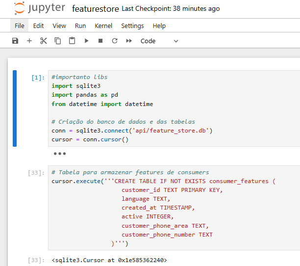
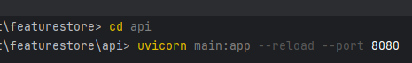
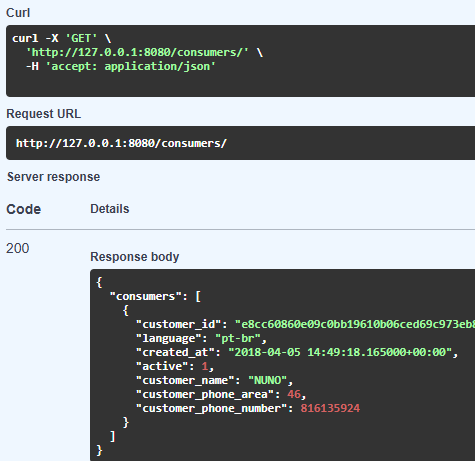
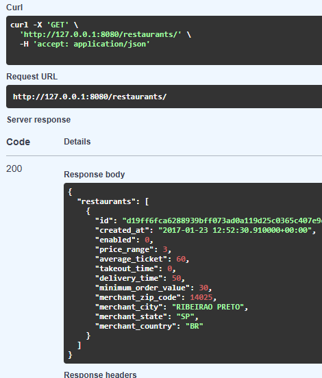

### 1. Project Information

Machine Learning - Feature Store Project - FastAPI

### 2. System Requirements

- Python 3.12.7: Ensure that Python 3.12.7 is installed.
- pip: Python package installer (usually included with Python installation).
- Virtualenv: (Optional, but recommended) to isolate dependencies.
- Terminal/cmd: after installing recommended packages from the requirements.txt file)

### 3. Installing Python 3.12.7

- If you don’t already have Python 3.12.7 installed, follow these instructions:

**Windows/OS**

- Download Python 3.12.7 from the official website.
- Run the installer and check the "Add Python to PATH" option.
- Verify if Python is correctly installed:
- Run the command below:

`
$ python --version
`

### 4. Setup Project Before Running

Follow the instructions below to set up the project:

**Clone the Repository**

- Download and install git on your computer and follow the steps 
  on the page available at: https://git-scm.com/downloads
- After installing git, open your computer's terminal/cmd.
- Clone the GitHub repository to your local environment.
- In the terminal/command line, type the command:

`
git clone https://github.com/sainclersilva/featurestore.git/
`

- Navigate to project directory

`
.../featurestore/
`

### 5. Installing Dependencies
This will install all libraries necessary for the project.

- After creating the virtual environment, the project dependencies 
  can be installed from the requirements.txt file:
- The "pip" command will be required for the steps below.
- Access the documentation to perform the package installation: 
  https://packaging.python.org/en/latest/guides/installing-using-pip-and-virtual-environments/

- Open the terminal/cmd.
- Access the project root directory (../featurestore).
- Verify if the directory contains the downloaded files.
- Now, move one level down in the directory <../>.
- To activate the project, type the following command:

`
featurestore/Scripts/activate
`

If the command runs successfully, the project name should appear in 
parentheses at the beginning of the line, as shown below:

`
(featurestore) PS C:/Users...

- Now, in the terminal, run the command:

`
pip install -r requirements.txt
`

**Paths will be automatically mapped using Python’s pathlib library.**

### 6. Running Project

- Open the terminal/cmd.
- Access the project root directory (../featurestore).
- Verify if the directory contains the downloaded files.
- Now move one level down in the directory <../>.
- To activate the project, type the following command:

`
featurestore/Scripts/activate
`

If the command runs successfully, the project name should appear in 
parentheses at the beginning of the line, as shown below:

`
(featurestore) PS C:/Users...
`

### 7. Running the Project (Jupyter Notebook)

To start the project and access the notebook through the Jupyter interface, 
run the following command in the **terminal/cmd**.

- Access the project directory (..\featurestore ).
- The notebook for this project is in the featurestore.ipynb file.
- Start Jupyter with the command below:

`
jupyter notebook featurestore.ipynb
`

- Access the link generated after executing the command 
  **http://localhost:8888/notebooks/featurestore.ipynb**.

- Now execute each notebook command to see the results.
- At the end of the notebook, there will be instructions 
  for interacting with the API.

### 8. Run API - FastAPI and Swagger Documentation

- Open another terminal.
- Access the project directory and enter the API folder (..featurestore\api).
- Run the following command in the terminal/cmd 
  (make sure you are in the project’s <api> directory, where the API's main.py file is located).

`
uvicorn main:app --reload --port 8080
`

- Access the API's Swagger documentation in your browser at: http://127.0.0.1:8080/docs
- You can interact with the API through the interface at the previous link.

- After executing the consumers or restaurant request, the data will be returned:

### 9. AWS Architecture

- The architecture diagram is available in the diagram directory.
- There are two diagrams that describe a potential architecture to support the project.
- Below is a description of the resources that may be considered for the AWS Infrastructure:

- a. Amazon SageMaker Feature Store:
  For storage, retrieval, and versioning of features.

- b. Amazon S3:
  To store large volumes of historical data and files for batch training.

- c. Amazon Redshift:
  To enable complex SQL analyses of features.

- d. Amazon DynamoDB:
  A NoSQL database for real-time feature retrieval with low latency, ideal for model inference.

- e. AWS Glue:
  A serverless ETL service to prepare, clean, and transform data into features, with batch and streaming support.

- f. Amazon RDS:
  Managed SQL databases for storing and querying relational features for models like consumers and restaurants.

- g. Amazon Kinesis:
  For real-time data ingestion (streaming, logs, metrics, etc.).

- h. Amazon EMR:
  For large-scale data processing with Spark, Hadoop, and distributed analysis tools.

- i. AWS Lambda:
  To run serverless functions in response to events and to transform features before ingestion.

- j. AWS IAM and KMS (Security):
  IAM to manage access, KMS for encryption resources.

-----------------------------------------------------------------------
-----------------------------------------------------------------------
-----------------------------------------------------------------------

### 1. Informações do projeto
Machine Learning - Feature Store Project - FastAPI

### 2. Requisitos do Sistema

- Python 3.12.7**: Certifique-se de ter o Python 3.12.7 instalado. 
- pip**: Instalador de pacotes do Python (geralmente já vem com a instalação do Python).
- Virtualenv**: (Opcional, mas recomendado) para isolar dependências.
- PyCharm 2024.2.3** (IDE recomendada, mas realizar a execução via Terminal após instalar 
  pacotes recomendados no arquivo requirements.txt) ou VSCode

### 3. Instalando o Python 3.12.7
Se você ainda não tem o Python 3.12.7 instalado, siga estas instruções:

Windows/OS

- Faça o download do Python 3.12.7 do [site oficial](https://www.python.org/downloads/release/python-3127/).
- Execute o instalador e marque a opção **"Add Python to PATH"**.
- Verifique se o Python foi instalado corretamente:

### 4. Verificando a versão instalada. Executando o comando abaixo

`
$ python --version
`

### 5. Configurando o Projeto antes da execução
Siga as instruções abaixo para configurar o projeto:

Clonando o Repositório

- Baixe e instale o git em seu computador e siga os procedimentos 
  conforme página disponível em: **https://git-scm.com/downloads**

- Após instalar o git, abra o terminal/cmd do seu computador
- Clone o repositório do GitHub para o seu ambiente local. 
- No terminal /linha de comando, digite o comando:

`
git clone https://github.com/sainclersilva/featurestore.git/
`

- b. Navegue até o diretório do projeto

`
cd <caminho do projeto clonado>
`

### 6. Instalando as Dependências
Isso instalará todas as bibliotecas necessárias para o projeto.

- Após a criação do ambiente virtual, as dependências do projeto podem 
  ser instaladas a partir do arquivo **requirements.txt**:

- Será necessário usar o comando "pip" para os passos abaixo
- Acesse a documentação para realizar a instalação do pacote: 
  https://packaging.python.org/pt-br/latest/guides/installing-using-pip-and-virtual-environments/

- Abra o terminal/cmd
- No terminal, execute o comando:

`
pip install -r requirements.txt
`

- Os paths serão mapeados automaticamente através da lib pathlib do Python

### 7. Executando o Projeto

- Abra o terminal/cmd
- Acesse o repositório raiz do projeto (exemplo: <**local no disco>/featurestore**)
- Verifique se o diretório possui os arquivos baixados
- Agora desça um nível do diretório <**local no disco**>
- Para ativar o projeto, digite o seguinte comando: 

`
featurestore/Scripts/activate
`

- Se o comando der certo, deve aparecer o nome do projeto 
  entre parênteses no inicio da linha conforme exemplo abaixo:

`
(featurestore) PS C:/Users... 
`

### 8. Executando o projeto (Notebook Jupter)

- Para iniciar o projeto e acessar o notebook através da interface do jupter,
execute o comando abaixo no terminal/cmd

- Acesse o diretório do projeto (..\featurestore )
- O notebook deste projeto está no arquivo featurestore.ipynb
- Vamos iniciar o jupter com o comando abaixo:

`
 jupyter notebook featurestore.ipynb
`

- Acesse o link gerado após execução do comando
  (http://localhost:8888/notebooks/featurestore.ipynb)
- Agora é só executar cada comando do notebook para ver os resultados
- Ao fim do notebook haverá as instruções para interagir com a API.

### 9. Executar API - FastAPI e Documentação Swagger

- Abra outro terminal
- Acesse o diretório do projeto e entre na pasta api (..featurestore\api)
- Execute o comando abaixo no terminal/cmd
  (certifique-se de estar no diretório <api> do projeto,onde se encontra o arquivo *main.py* da API)

`
uvicorn main:app --reload --port 8080
`

- Acesse a documentação Swagger da API no navegador em: http://127.0.0.1:8080/docs
- Pode-se interagir com a API através da interface do link anterior.

### 10. Arquitetura AWS

- O desenho da arquitetura está disponível no diretório **diagram**
- Existem dois desenhos que descrevem uma possível arquitetura para atender o projeto

### Abaixo descrição dos recursos que podem ser considerados com Infra AWS:

- a. Amazon SageMaker Feature Store: 
Para armazenamento, recuperação e versionamento de features

- b. Amazon S3: 
Para armazenar grandes volumes de dados históricos e arquivos para treinos em batch

- c. Amazon Redshift: 
Para permitir análises SQL complexas de features

- d. Amazon DynamoDB: 
Banco de dados NoSQL para recuperar features em tempo real com latência baixa, 
ideal para inferência de modelos.

- e. AWS Glue: 
Serviço de ETL serverless para preparar, limpar e transformar dados em features, 
com suporte a batch e streaming.

- f. Amazon RDS: 
Bancos SQL gerenciados para armazenamento e consulta de features relacionais aos 
modelos como consumers e restaurants.

- g. Amazon Kinesis: 
Para ingestão de dados em tempo real (streaming, logs, métricas, etc)

- h. Amazon EMR: 
Para processar dados em larga escala com Spark, Hadoop, 
e ferramentas de análise distribuída.

- i. AWS Lambda: 
Para execução de funções serverless em resposta a eventos
Para transformar features antes da ingestão.

- j. AWS IAM e KMS (Segurança): 
IAM para gerenciar acessos
KMS para recursos de criptografia

--------------------------------------------------------------