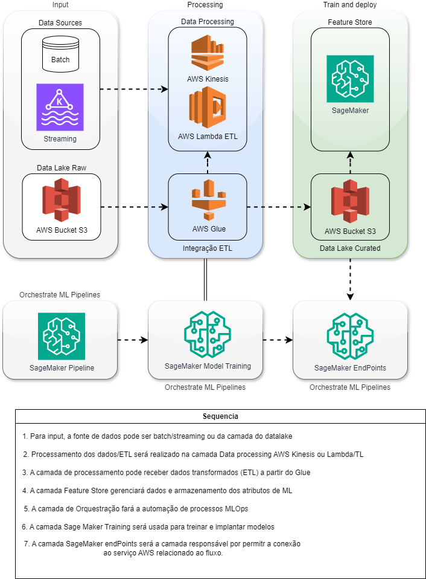
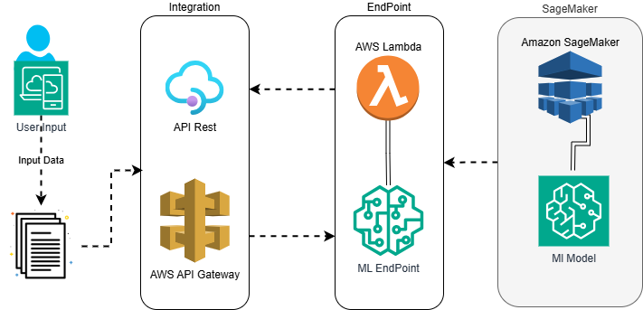

### 1. Project Information

Machine Learning - Feature Store Project - FastAPI

### 2. System Requirements

- Python 3.12.7**: Ensure Python 3.12.7 is installed.
- pip**: Python package installer (usually included with the Python installation).
- Virtualenv**: (Optional, but recommended) to isolate dependencies.
- PyCharm 2024.2.3** (recommended IDE) or VSCode

### 3. Installing Python 3.12.7

If you do not have Python 3.12.7 installed, follow these instructions:

Windows/OS

- Download Python 3.12.7 from the official website.
- Run the installer and check the option "Add Python to PATH".
- Verify if Python was installed correctly:

### 4. Checking the Installed Version. Run the following command

`
$ python --version
`

### 5. Setting up the Project in PyCharm 2024.2.3 (VSCode may also be used)

Follow the instructions below to set up the project in PyCharm:

- Cloning the Repository

- First, clone the GitHub repository to your local environment.
- In the PyCharm terminal or command line, run:

`
git clone https://github.com/sainclersilva/featurestore.git/
`

- Navigate to the project directory

`
cd <cloned project path>
`

### 6. Opening the Project in PyCharm 2024.2.3

- Open PyCharm.
- In the initial menu, click on File > Open.
- Navigate to the directory of the cloned project and click OK.

### 7. Creating a Virtual Environment in PyCharm

- In PyCharm, open Settings (Ctrl+Alt+S or Cmd+, on Mac).
- Go to Project: project-name > Python Interpreter.
- In the top-right corner, click on the gear icon and select Add > Virtualenv Environment.
- Choose New environment and click OK to create the virtual environment.

### 8. Installing Dependencies

This will install all necessary libraries for the project.

- After creating the virtual environment, project dependencies can be installed 
  from the **requirements.txt** file:
- In PyCharm, open the integrated terminal (Alt+F12 or Cmd+Option+T on Mac).
- In the terminal, run the command:

`
pip install -r requirements.txt
`

Paths will be automatically mapped through Python's pathlib library.

### 9. Running the Project (Jupyter Notebook)

To start the project and access the notebook via Jupyter, 
run the command below in the integrated PyCharm terminal:

`
jupyter notebook
`

- Access the link generated after executing the command.
- Then, open the feast_step.ipynb file **(http://localhost:8888/notebooks/featurestore.ipynb)**.
- Now, simply execute each cell in the notebook to see the results.
- At the end of the notebook, instructions for interacting with the API will be provided.

### 10. Running the API - FastAPI and Swagger Documentation

- Run the following command in the PyCharm integrated terminal (ensure you are in the project's 
<api> directory, where the API's main.py file is located)

`
uvicorn main:app --reload --port 8080
`

- Access the API's Swagger documentation in your browser at: **http://127.0.0.1:8080/docs**
- You can interact with the API through the previous link's interface.

### 11. AWS Architecture

- The architecture diagram is available in the **diagram** directory.
- There are two diagrams that describe a possible architecture to support the project.

-----------------------------------------------------------------------

### 1. Informações do projeto
Machine Learning - Feature Store Project - FastAPI

### 2. Requisitos do Sistema

- Python 3.12.7**: Certifique-se de ter o Python 3.12.7 instalado. 
- pip**: Instalador de pacotes do Python (geralmente já vem com a instalação do Python).
- Virtualenv**: (Opcional, mas recomendado) para isolar dependências.
- PyCharm 2024.2.3** (IDE recomendada) ou VSCode

### 3. Instalando o Python 3.12.7
Se você ainda não tem o Python 3.12.7 instalado, siga estas instruções:

Windows/OS

- Faça o download do Python 3.12.7 do [site oficial](https://www.python.org/downloads/release/python-3127/).
- Execute o instalador e marque a opção **"Add Python to PATH"**.
- Verifique se o Python foi instalado corretamente:

### 4. Verificando a versão instalada. Executando o comando abaixo

`
$ python --version
`

### 5. Configurando o Projeto no PyCharm 2024.2.3 (pode usar VSCode também)
Siga as instruções abaixo para configurar o projeto no **PyCharm**:

Clonando o Repositório

- Primeiro, clone o repositório do GitHub para o seu ambiente local. 
- No terminal do PyCharm ou na linha de comando, execute:

`
git clone https://github.com/sainclersilva/featurestore.git/
`

- b. Navegue até o diretório do projeto

`
cd <caminho do projeto clonado>
`

### 6. Abrindo o Projeto no PyCharm 2024.2.3

- Abra o PyCharm.
- No menu inicial, clique em File > Open.
- Navegue até o diretório do projeto que você clonou e clique em OK.

### 7. Criando um Ambiente Virtual no PyCharm

- No PyCharm, abra o Settings (Ctrl+Alt+S ou Cmd+, no Mac).
- Navegue até Project: nome-do-projeto > Python Interpreter.
- No canto superior direito, clique no ícone de engrenagem e selecione Add > Virtualenv Environment.
- Escolha New environment e clique em OK para criar o ambiente virtual.

### 8. Instalando as Dependências
Isso instalará todas as bibliotecas necessárias para o projeto.

- Após a criação do ambiente virtual, as dependências do projeto podem 
  ser instaladas a partir do arquivo **requirements.txt**:
- No PyCharm, abra o terminal integrado (Alt+F12 ou Cmd+Option+T no Mac).
- No terminal, execute o comando:

`
pip install -r requirements.txt
`

- Os paths serão mapeados automaticamente através da lib pathlib do Python

### 9. Executando o projeto (Notebook Jupter)

- Para iniciar o projeto e acessar o notebook através da interface do jupter,
execute o comando abaixo no terminal integrado ao PyCharm

`
jupyter notebook
`

- Acesse o link gerado após execução do comando
- Depois acesse o arquivo **feast_step.ipynb** (http://localhost:8888/notebooks/featurestore.ipynb)
- Agora é só executar cada comando do notebook para ver os resultados
- Ao fim do notebook haverá as instruções para interagir com a API.

### 10. Executar API - FastAPI e Documentação Swagger

- Execute o comando abaixo no terminal integrado do PyCharm
  (certique-se de estar no diretório <api> do projeto, onde se encontra o arquivo *main.py* da API)

`
uvicorn main:app --reload --port 8080
`

- Acesse a documentação Swagger da API no navegador em: http://127.0.0.1:8080/docs
- Pode-se interagir com a API através da interface do link anterior.

### 11. Arquitetura AWS

- O desenho da arquitetura está disponível no diretório **diagram**
- Existem dois desenhos que descrevem uma possível arquitetura para atender o projeto

### -------------------------------------------------------------- ###